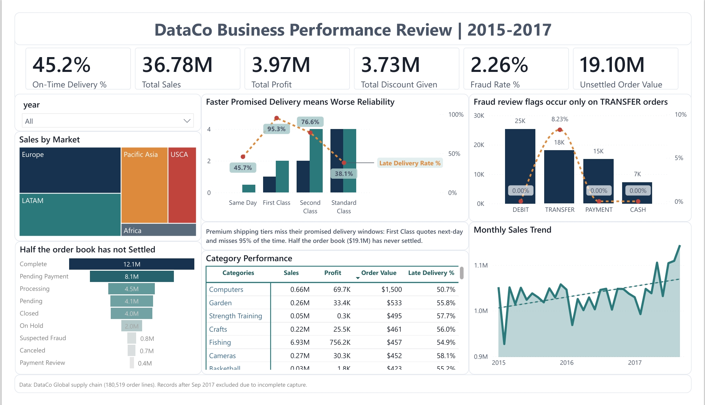

# DataCo Business Performance Review

### 95% of First Class orders arrive late. $19M in revenue was never collected. Every fraud flag traced to one payment method.

An end-to-end analytics project that takes a raw 180,000-row supply chain dataset
from messy file to boardroom decision: a reproducible Python ETL, a validated
PostgreSQL star-schema warehouse, a SQL reporting layer, a Power BI dashboard, and
a leakage-aware prediction model. Every finding below is backed by code you can
open and run.



---

## Three findings a stakeholder would act on

**Premium shipping can't keep its promises.**
First Class quotes next-day delivery and misses it **95% of the time**, because it
actually takes two days. Standard Class, which quotes four days, is the most
reliable tier. The company is late on **55% of all shipments**, and the cause is
the delivery promise, not the warehouse. Reset the quoted windows and most late
deliveries become on-time at zero cost.

**Half the money is stuck.**
Of $36.8M in orders, only **$16.1M has been collected**. **$19.1M** sits
unsettled, $8.1M of it in pending payment alone. In dollar terms this is a bigger
problem than the delivery issue, and no existing report was tracking it.

**"Fraud" is a system rule, not fraud.**
**100% of suspected-fraud flags** are on bank-transfer orders; debit, cash, and
other methods show zero. A pattern that clean is an automated review rule, not
real fraud. Flagging that, rather than reporting a 2.26% fraud rate at face value,
is the honest read.

---

## Why this isn't the tutorial version

The DataCo dataset is common. Most versions of it are a notebook and a chart. This
one is built the way a data team ships work:

- **A real warehouse, not a flat file.** Star schema with enforced keys, a SQL
  view layer, and a self validating ETL that strips PII and checks its own
  referential integrity.
- **An honest data-quality call.** Order volume collapses after September 2017;
  rather than report a fake revenue cliff, the analysis identifies it as broken
  data capture and excludes it. The limitation is documented, not hidden.
- **A model that doesn't cheat.** The late-delivery model excludes outcome columns
  to prevent data leakage, so it earns an honest ~70% instead of a fake 99%. Three
  model types were benchmarked; the simplest, most explainable one was kept.
- **Findings that agree.** SQL, the dashboard, and the model independently reach
  the same conclusion: shipping mode drives lateness. When three methods agree,
  the finding is real.

---

## The prediction model, briefly

`model/late_delivery_prediction.ipynb` predicts whether an order will be late
using only what's known at order time (shipping mode, promised days, market,
segment, category, quantity, discount, price). It reaches **~70% accuracy** versus
a 55% base rate, and its feature weights confirm First Class as the single
strongest risk signal, four times any other factor. The decision threshold can be
tuned to catch more late orders when intervention is cheap, or fewer false alarms
when it's costly.

---

## Tech stack

Python (pandas, scikit-learn) · PostgreSQL · SQL · Power BI (DAX) · star-schema dimensional modeling

---

## What's in this repo

| Area | What it is |
|---|---|
| **ETL** | Python pipeline: cleans raw data, strips PII, models a star schema, validates itself. |
| **Data quality** | Standalone check script: keys, referential integrity, PII, value bounds. |
| **Warehouse** | PostgreSQL schema (DDL) and a one-command load script. |
| **SQL analysis** | Six business questions answered with documented queries. |
| **Reporting views** | A layer of SQL views on the warehouse, one per business question, so logic lives in one place. |
| **Semantic model** | Power BI model: 20+ DAX measures, role-playing date dimension, custom theme. |
| **Dashboard** | Single-page business performance review (the image above). |
| **Prediction model** | Logistic regression predicting late delivery from order-time features (Python, scikit-learn). |
| **Docs** | Data dictionary, findings, recommendations, dashboard spec. |

Full recommendations: [`docs/04_recommendations.md`](docs/04_recommendations.md) ·
Data dictionary: [`docs/05_data_dictionary.md`](docs/05_data_dictionary.md)

---

## How it's built

**Star schema.** The raw 53 column flat file is modeled into one fact table at
order-line grain plus six dimensions (order, customer, product, category,
department, date). Grain is the finest available, so any metric rolls up cleanly.

**Reproducible ETL.** `etl/clean_and_model.py` reads the Latin-1 source, removes
PII, drops dead and duplicate columns, standardizes names, and models the tables.
`etl/data_quality_checks.py` then validates keys, referential integrity, and PII
removal, exiting with a pass/fail code.

**Semantic model.** The Power BI layer defines 20+ measures once (sales, margin,
late rate, revenue at risk, fraud rate, unsettled value), with additivity handled
correctly and a role-playing date dimension for order vs. shipping date.

---

## Reproduce it

```bash
pip install -r requirements.txt

python etl/clean_and_model.py        # raw CSV -> modeled star-schema tables
python etl/data_quality_checks.py    # validate the warehouse (exit 0 = pass)
./warehouse/load_postgres.sh         # build the PostgreSQL warehouse (optional)
```

Then open `powerbi/` for the measures and theme, `sql/` for the analysis and
views, and `model/` for the prediction notebook.

---

## Repo structure

```
etl/          clean_and_model.py, data_quality_checks.py
warehouse/    schema.sql, load_postgres.sh
sql/          analysis.sql, views.sql
powerbi/      measures.dax, theme.json
model/        late_delivery_prediction.ipynb
docs/         data model, findings, recommendations, data dictionary, dashboard spec
data/         processed tables (raw data not committed)
```

---

## Data and limitations

Source: DataCo Global supply chain, 180,519 order lines. Order volume drops by
more than half after September 2017 with no change in any other metric, which
indicates incomplete data capture rather than a real decline. Analysis is limited
to the clean window (Jan 2015 – Sep 2017). Late delivery, margin, and discount
rate are flat across market, segment, category, and day of week, which is why the
analysis focuses on shipping mode and order status, where the real variation is.
The fraud figure reflects a likely system rule and is not treated as an observed
fraud rate.
